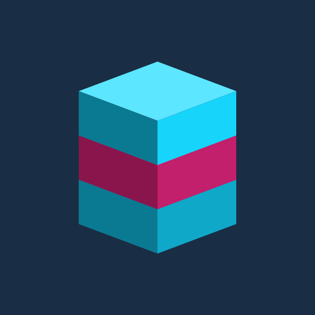

<div align="center">



# RORORO

_Multi-launcher for Windows — run multiple Roblox clients on Windows, signed in as different saved accounts._

[](https://github.com/estevanhernandez-stack-ed/ROROROblox/releases)
[](https://github.com/estevanhernandez-stack-ed/ROROROblox/stargazers)
[](#license)
[](https://www.microsoft.com/windows/windows-11)
[](https://dotnet.microsoft.com/)

**Windows 11** · **Windows 10 22H2** (direct download) · **.NET 10 LTS** · **WPF**

</div>

> **"Roblox" is a trademark of Roblox Corporation.** RORORO is not affiliated with, endorsed by, or sponsored by Roblox Corporation. We use the term to describe compatibility — this app launches the official Roblox client unmodified. A 626 Labs product.

---

## The plugin family

RoRoRo is a launcher with an ecosystem. Plugins are separately distributed Windows apps on a gRPC contract — each one declares its capabilities up front, shows you a consent sheet before it gets any of them, and installs SHA-256-verified. Three are live:

| Plugin | What it does | Version |
|---|---|---|
| [**RoRoRo Ur Task**](https://github.com/estevanhernandez-stack-ed/rororo-ur-task) | Per-window-aware macro recording. Record once, play on any alt — round-robin assignments, keep-alive, window-relative mouse macros, an action bridge for sibling plugins. |  |
| [**RoRoRo Ur OCR**](https://github.com/estevanhernandez-stack-ed/Ur-OCR) | Watches screen regions for text or color triggers and fires keybinds when they match. Pairs with Ur Task for perception-to-action. |  |
| [**RoRoRo Ur AFK**](https://github.com/estevanhernandez-stack-ed/rororo-ur-afk) | Keeps idle accounts alive — focuses each and taps space before the ~20-minute idle timeout. One toggle, one key ever sent. |  |

**Browse and install from the [plugin marketplace →](https://626labs.dev/rororo-plugins.html)** — live versions, install links, and what each plugin does, refreshed automatically whenever one ships. Direct-download builds (v1.9+) also carry the marketplace inside the app: **Plugins → Available**.

Building your own? Start at [`docs/plugins/AUTHOR_GUIDE.md`](docs/plugins/AUTHOR_GUIDE.md). The contract is `ROROROblox.PluginContract` on NuGet — bundle it, implement the gRPC client, ship a `manifest.json` + `manifest.sha256` + `plugin.zip` GitHub release.

---

## What's new in v1.9

**The in-app plugin marketplace.** The Plugins window on direct-download builds now has an **Available** section fed by a remote catalog — browse, install, and get **update badges** when an installed plugin falls behind its latest release. Installs stay SHA-256-verified against each plugin's own manifest; the catalog carries metadata and an install URL, never code.

Why unpackaged-only: the Microsoft Store edition can't ship downloadable-code surfaces (Store policy 10.2.2), so Store users get the same catalog through the [web marketplace](https://626labs.dev/rororo-plugins.html) instead.

Also in v1.9: the Store build's OS floor drops to **Windows 10 22H2** (previously the Store edition was Windows 11-only).

Version-by-version history lives on the [Releases page](https://github.com/estevanhernandez-stack-ed/ROROROblox/releases).

---

## Install

### Microsoft Store *(recommended)*

[**Install RoRoRo on the Microsoft Store →**](https://apps.microsoft.com/detail/9NMJCS390KWB)

Signed by Microsoft, bypasses SmartScreen entirely, auto-updates through the Store. Best path for most clan members — one click and you're in.

### GitHub Releases *(clan-direct fallback)*

If you'd rather skip the Store account flow, or want to install on a PC without Store access:

1. Download the latest `rororo-win-Setup.exe` from [Releases](https://github.com/estevanhernandez-stack-ed/ROROROblox/releases).
2. Double-click it. SmartScreen will warn (the installer is unsigned) — click **More info** → **Run anyway**. (One-time per machine.)
3. RORORO installs to your user profile, lands in the Start Menu, and auto-updates from this Releases page going forward — no second SmartScreen prompt on later versions.

A 30-second video walkthrough is linked from each Release page.

**On Windows 10?** This is your path — the Store version needs Windows 11, but `Setup.exe` runs on **Windows 10 22H2, fully updated**. Run Windows Update first: a Windows 10 that's behind on updates can't start modern .NET apps and RoRoRo won't launch (that's the #1 thing to check if it doesn't open). If Roblox login asks for Microsoft's WebView2, the app hands you the free installer — one click, then try again. Best-effort support: the app installs, runs, and manages accounts on a fully-updated Windows 10 22H2; multi-instance uses the exact same code as Windows 11. Windows 10 left Microsoft's support lifecycle in October 2025, so plan the Windows 11 upgrade when you can.

> Prefer MSIX? `RORORO-Sideload.msix` + `dev-cert.cer` are also attached to each release — same app, slightly more setup (you import the cert once into Trusted People, then double-click the MSIX). Use whichever flow you trust more.

## What it does

- **One-click multi-instance.** Tray toggle holds the Roblox singleton mutex so multiple clients can run side by side. Same trick MultiBloxy and other tools use, just packaged for the rest of us.
- **Saved Roblox accounts.** Add your alts once via an embedded login window. Click *Launch As* to spawn each one.
- **DPAPI-encrypted account vault.** Saved cookies are tied to your Windows user. A copy of `accounts.dat` moved to another PC won't decrypt.
- **Per-game launch routing.** Set a default Roblox game URL once; *Launch As* lands every alt in that game.
- **System tray UX.** State-coloured ring shows mutex status at a glance (cyan = on, slate = off, magenta = error).
- **Velopack auto-update.** Drift-compatible with Roblox-side changes; remote `roblox-compat.json` config tells the app the current known-good Roblox version + mutex name.
- **No DevTools, no registry edits.** Common-Windows-user UX from install through launch.

## How to use

1. Click RORORO in the system tray to open the main window.
2. Click **+ Add Account**, log in with the Roblox account you want to save. The login happens entirely inside Roblox's own page — your password never touches our process.
3. Repeat for each alt.
4. Right-click the tray icon → toggle **Multi-Instance: ON**.
5. Click **Launch As** next to any saved account. Repeat for any other account to spawn another client.

The first time you Launch As, you'll be prompted for a default Roblox game URL. Paste any Roblox game's `roblox.com/games/...` link — that's where Launch As will land your alts. Edit it later in Settings.

## What gets stored on your PC

| Where | What |
|---|---|
| `%LOCALAPPDATA%\ROROROblox\accounts.dat` | Your saved Roblox cookies. **DPAPI-encrypted** (Windows-issued; tied to your Windows user). Cannot be moved between PCs. |
| `%LOCALAPPDATA%\ROROROblox\settings.json` | Your default game URL + UI preferences. Plain text (no secrets). |
| `%LOCALAPPDATA%\ROROROblox\webview2-data\` | Embedded-browser cache. Wiped before every Add Account so the next login starts on a fresh page. |
| `%LOCALAPPDATA%\ROROROblox\consent.dat` | Per-plugin consent records (capabilities granted, autostart toggle). **DPAPI-encrypted**, same secrecy contract as `accounts.dat`. Empty until you install your first plugin. |
| `%LOCALAPPDATA%\ROROROblox\plugins\<plugin-id>\` | Installed plugin files (the EXE + `manifest.json` from each plugin you installed). Plain files — plugins are not encrypted, but each plugin's behavior is gated by your `consent.dat` capability grants. |

## What about my Roblox password?

Short version: **RORORO never sees it.**

Long version: when you click *Add Account*, RORORO opens an embedded Microsoft Edge WebView2 control pointed at `https://www.roblox.com/login`. The login page is Roblox's own — same HTML, same form, same HTTPS connection your browser would make. Your keystrokes go from the embedded browser straight to Roblox's servers. RORORO is the window frame, not the form handler.

What we **do** capture, after Roblox confirms a successful login, is the `.ROBLOSECURITY` session cookie that Roblox sets in your browser. That cookie is what we hand back to Roblox during *Launch As* to start a session as you. Before we write it to disk, we run it through Windows' [Data Protection API](https://learn.microsoft.com/en-us/dotnet/standard/security/how-to-use-data-protection) — encryption tied to your specific Windows user account on your specific machine. The encrypted file (`accounts.dat`) is unreadable on any other PC, by any other Windows user, or even by you if Windows ever loses its DPAPI master key (e.g., after a from-scratch reinstall).

We never log the cookie value. We never send the cookie to anyone other than Roblox. It exists in plaintext only briefly in memory during a single *Launch As* operation, then goes back to disk in encrypted form.

**No cookies are ever written to disk in plaintext. No data leaves your PC except Roblox-side calls during launch — the same calls Roblox.com makes from your browser.**

## Tech stack

- **.NET 10 LTS** + **C# 14**
- **WPF** + **WPF-UI** (Fluent-style controls)
- **Hardcodet.NotifyIcon.Wpf** (system tray)
- **Microsoft.Web.WebView2** (login capture)
- **Microsoft.Windows.CsWin32** (typed P/Invokes for the singleton-mutex hold)
- **System.Security.Cryptography.ProtectedData** (DPAPI envelope on saved cookies)
- **Velopack** (auto-update via GitHub Releases)
- **xUnit** (unit + integration tests)

## Provenance

The named-mutex defeat technique originated with **MultiBloxy** by [Zgoly](https://github.com/Zgoly/MultiBloxy). RORORO is **not a fork** — it's a clean reimplementation in C# with substantially expanded scope (account management, structured launch flow, error handling, distribution). The reference binary `MultiBloxy.exe` is in this repo for verification; details + hash + caveats in [`PROVENANCE.txt`](PROVENANCE.txt).

## Roblox-side caveats

- Roblox / Hyperion has stated that multi-instancing "may be considered malicious behavior." Risk of a ban appears low because we don't inject into or modify the Roblox client — we only hold a Windows mutex name before launch. But it is non-zero. Don't run this on accounts you can't afford to lose.
- The auth-ticket endpoint contract is what we depend on. If Roblox changes it, multi-instance launches will start failing — see the [auth-ticket-flow-validator agent](.claude/agents/auth-ticket-flow-validator.md) and the version-drift banner in the main window.

## Building from source

See [`CONTRIBUTING.md`](CONTRIBUTING.md) for the dev setup, spike re-run, and MSIX packaging walkthroughs. Short version:

```powershell
# Day-to-day
dotnet build
dotnet test
dotnet run --project src/ROROROblox.App

# Regenerate Store-bound logo assets (Direction C iso voxel stack)
powershell -ExecutionPolicy Bypass -File scripts/generate-store-assets.ps1
powershell -ExecutionPolicy Bypass -File scripts/generate-tray-icons.ps1

# Build sideload MSIX (after items 11-12 from docs/checklist.md land)
powershell -ExecutionPolicy Bypass -File scripts/build-msix.ps1 -Sideload -CertPath dev-cert.pfx -CertPassword '...'
```

## Documentation

- **Privacy policy:** [`docs/PRIVACY.md`](docs/PRIVACY.md)
- **Architecture & decisions:** [`docs/superpowers/specs/2026-05-03-RORORO-design.md`](docs/superpowers/specs/2026-05-03-RORORO-design.md)
- **Build plan:** [`docs/checklist.md`](docs/checklist.md)
- **Cycle process notes:** [`process-notes.md`](process-notes.md)
- **Security audit:** [`docs/security-audit-2026-05-04.md`](docs/security-audit-2026-05-04.md)
- **Microsoft Store submission:** [`docs/store/submission-checklist.md`](docs/store/submission-checklist.md) — pre/post-flight procedure, listing copy, age rating, screenshots
- **Plugin author guide (v1.4+):** [`docs/plugins/AUTHOR_GUIDE.md`](docs/plugins/AUTHOR_GUIDE.md) — contract surface, capability vocabulary, manifest format, gRPC client connection example
- **Repo conventions for AI agents:** [`CLAUDE.md`](CLAUDE.md)

## Roadmap

**Shipped**
- [x] Multi-instance via singleton-mutex hold
- [x] DPAPI-encrypted account vault
- [x] Per-account *Launch As* via documented authentication-ticket flow
- [x] System tray with state-coloured ring
- [x] Velopack auto-update via GitHub Releases
- [x] Remote `roblox-compat.json` config (mutex name + known-good Roblox versions)
- [x] Sideload MSIX with self-signed cert
- [x] Squad Launch + Friend Follow surfaces
- [x] Join-by-link entry per saved account (with optional **Save to my library** toggle, v1.3.x — saves the pasted game or private server to your library for next time)
- [x] Microsoft Store listing ([live](https://apps.microsoft.com/detail/9NMJCS390KWB))
- [x] Plugin host — named-pipe gRPC, consent sheets, SHA-verified installs (v1.4)
- [x] Plugin marketplace — in-app (direct builds, v1.9) + [on the web](https://626labs.dev/rororo-plugins.html)

**Up next**
- [ ] **Arm64 (AArch64) build target.** Partner Center flagged that future Windows on Arm devices will not support AArch32; current MSIX is x64-only. Add an Arm64 build flavor + manifest variant so customers on Arm devices can install. Track for v1.1.1 or v1.2.
- [ ] **About-box version pulls from manifest, not `Assembly.GetName().Version`.** Currently shows `v1.0.0` because the .NET-default assembly version was never overridden; the MSIX manifest's `<Identity Version>` is the source of truth. Pivot to `Package.Current.Id.Version` at runtime. See [`docs/store/next-revision-followups.md`](docs/store/next-revision-followups.md) §3.
- [ ] **Add Account WebView2 white-screen affordance.** Sometimes the embedded login page renders blank on first load and the user has to refresh; add a visible reload hint. See [`docs/store/next-revision-followups.md`](docs/store/next-revision-followups.md) §1.
- [ ] **Games / Settings tab — make scrollability obvious.** Content can extend past the default window viewport with no scrollbar affordance. See [`docs/store/next-revision-followups.md`](docs/store/next-revision-followups.md) §2.
- [ ] **Session "expired" vs "needs Roblox 2FA re-verify" — distinguish them.** Today using Friends / Squad Launch / presence-fetching endpoints can surprise-trigger Roblox's anti-fraud re-auth flow within minutes of saving an account; we incorrectly mark the cookie as expired and force a full re-login, when Roblox just wanted a 2FA re-confirm. Add a `NeedsReverification` state distinct from `SessionExpired`, lazy-validate (skip startup pass), better re-auth-flow messaging. See [`docs/store/next-revision-followups.md`](docs/store/next-revision-followups.md) §4.
- [ ] Per-cookie encryption envelope (today: whole-blob; v1.2: per-account)
- [ ] Per-account WebView2 profile isolation (today: shared cache, wiped pre-login)
- [ ] Crash report opt-in (today: local logs only)
- [ ] Winget manifest (`winget install RORORO`)
- [ ] Auto-detect when Roblox renames the singleton mutex; warn with current `roblox-compat.json` version

## Why "RORORO"?

The name is a stutter spelling of **Roblox** — *RO RO RO blox* — visualizing what the app does: spawn three (or more) Roblox clients side by side. The icon mirrors the wordmark: three voxel blocks stacked, cyan-bright on top, magenta in the middle, cyan at the base. The tagline "Multi-launcher for Windows" leans into the same beat.

The brand DNA is 626 Labs — neon cyan + magenta on deep navy, geometric type, builder-to-builder voice. *Imagine Something Else* is the umbrella; **Multi-launcher for Windows** is the product.

> "Roblox" and the Roblox logo are trademarks of Roblox Corporation. RORORO is an independent third-party tool, not affiliated with, endorsed by, or sponsored by Roblox Corporation. The trademarked term is used solely to describe compatibility with the Roblox platform.

## License

Source code is **MIT-licensed** © 626 Labs LLC. Do whatever you want with it.

The reference binary (`MultiBloxy.exe`) is governed by Zgoly's original license — see [`PROVENANCE.txt`](PROVENANCE.txt).

---

<div align="center">

<sub>A <strong>626 Labs</strong> product · <em>Multi-launcher for Windows</em></sub>

</div>
