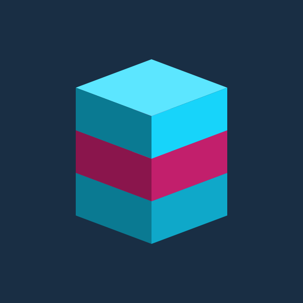

<div align="center">



# RORORO

_Multi-launcher for Windows — run multiple Roblox clients on Windows, signed in as different saved accounts._

[](https://github.com/estevanhernandez-stack-ed/ROROROblox/releases)
[](https://github.com/estevanhernandez-stack-ed/ROROROblox/stargazers)
[](#license)
[](https://www.microsoft.com/windows/windows-11)
[](https://dotnet.microsoft.com/)

**Windows 11** · **Windows 10 22H2** · **.NET 10 LTS** · **WPF**

</div>

> **"Roblox" is a trademark of Roblox Corporation.** RORORO is not affiliated with, endorsed by, or sponsored by Roblox Corporation. We use the term to describe compatibility — this app launches the official Roblox client unmodified. A 626 Labs product.

---

## The plugin family

RoRoRo is a launcher with an ecosystem. Plugins are separately distributed Windows apps on a gRPC contract — each one declares its capabilities up front, shows you a consent sheet before it gets any of them, and installs SHA-256-verified. Three are live:

| Plugin | What it does | Version |
|---|---|---|
| [**RoRoRo Ur Task**](https://github.com/estevanhernandez-stack-ed/rororo-ur-task) | Per-window-aware macro recording. Record once, play on any alt — round-robin assignments, keep-alive, window-relative mouse macros, an action bridge for sibling plugins. |  |
| [**RoRoRo Ur OCR**](https://github.com/estevanhernandez-stack-ed/Ur-OCR) | Watches screen regions for text or color triggers and fires keybinds when they match. Pairs with Ur Task for perception-to-action. |  |
| [**RoRoRo Ur AFK**](https://github.com/estevanhernandez-stack-ed/rororo-ur-afk) | Keeps idle accounts alive — focuses each and taps space before the ~20-minute idle timeout. One toggle, one key ever sent. |  |

**Browse and install from the [plugin marketplace →](https://626labs.dev/rororo-plugins.html)** — live versions, install links, and what each plugin does, refreshed automatically whenever one ships. Direct-download builds (v1.9+) also carry the marketplace inside the app: **Plugins → Available**.

Building your own? Start at [`docs/plugins/AUTHOR_GUIDE.md`](docs/plugins/AUTHOR_GUIDE.md). The contract is `ROROROblox.PluginContract` on NuGet — bundle it, implement the gRPC client, ship a `manifest.json` + `manifest.sha256` + `plugin.zip` GitHub release.

---

## What's new in v1.21

When v1.21 reached the Store it covered **six releases** (the Store edition had been on v1.15). The Store edition is on **v1.23.0.0** as of 2026-08-23; the [Releases page](https://github.com/estevanhernandez-stack-ed/ROROROblox/releases) carries the notes for every version since.

**Launching your alts while Roblox is updating.** RoRoRo used to release the whole batch, and then every client would separately discover it was out of date and start updating at once. It now checks the version that is actually about to run, holds the batch, updates once, then releases the rest.

**Settings is a real place.** Memory warnings, how much RAM to keep free, how big one client can get before you hear about it, alert timing, careful mode for Squad Launch — all of it had needed a text editor. Leave a box empty and the page tells you what RoRoRo picks for your PC, with the actual numbers.

**A fourth theme, and buttons that behave.** Flatline carries no meaning in colour at all, so nothing is lost to colour blindness, a bad monitor, or direct sun. Buttons stopped flashing pale Windows blue on hover — they had done that in every theme since v1.1. Build your own theme from ten colours and it saves as a file you can hand to someone else.

**Readability.** Text that was too faint to read against its own background is fixed in two places, one of which had been that way since the theme it belongs to was written. Disabled buttons are legible now.

**Smaller things.** Compact mode survives a restart. Plugins shut down with RoRoRo instead of being left running. A theme that fails to save says so, and still applies for the session.

Plugins stay unpackaged-only: the Store edition can't ship downloadable-code surfaces (Store policy 10.2.2), so Store users get the same catalog through the [web marketplace](https://626labs.dev/rororo-plugins.html) instead.

Version-by-version history lives on the [Releases page](https://github.com/estevanhernandez-stack-ed/ROROROblox/releases).

---

## Install

### Microsoft Store *(recommended)*

[**Install RoRoRo on the Microsoft Store →**](https://apps.microsoft.com/detail/9NMJCS390KWB)

Signed by Microsoft, bypasses SmartScreen entirely, auto-updates through the Store. Best path for most clan members — one click and you're in.

### GitHub Releases *(clan-direct fallback)*

If you'd rather skip the Store account flow, or want to install on a PC without Store access:

1. Download the latest `RORORO-win-Setup.exe` from [Releases](https://github.com/estevanhernandez-stack-ed/ROROROblox/releases).
2. Double-click it. SmartScreen will warn (the installer is unsigned) — click **More info** → **Run anyway**. (One-time per machine.)
3. RORORO installs to your user profile and lands in the Start Menu. It checks this Releases page for a newer version once a day; if you find yourself behind, download and run the latest `Setup.exe` again (no second SmartScreen prompt on later versions).

A 30-second video walkthrough is linked from each Release page.

**On Windows 10?** Either path works. **The Store edition supports Windows 10 22H2** — its package floor is `10.0.19045`, and the "Store needs Windows 11" line that used to sit here was wrong from v1.9 onward, when the floor dropped. `Setup.exe` runs there too.

Run Windows Update first either way: a Windows 10 that's behind can't start modern .NET apps and RoRoRo won't launch — that's the #1 thing to check if it doesn't open. If Roblox login asks for Microsoft's WebView2, the app hands you the free installer; one click, then try again. Multi-instance uses the exact same code on both. Windows 10 left Microsoft's support lifecycle in October 2025, so plan the Windows 11 upgrade when you can.

> Prefer MSIX? A signed `RORORO-Sideload-x64-<version>.msix` plus `dev-cert.cer` can be attached to a release on request — same app, slightly more setup (import the cert once into Trusted People, then double-click the MSIX). There's also a `RORORO-win-Portable.zip` on each release if you'd rather not install anything at all.

## What it does

- **One-click multi-instance.** Tray toggle holds the Roblox singleton mutex so multiple clients can run side by side. Same trick MultiBloxy and other tools use, just packaged for the rest of us.
- **Saved Roblox accounts.** Add your alts once via an embedded login window. Click *Launch As* to spawn each one.
- **DPAPI-encrypted account vault.** Saved cookies are tied to your Windows user. A copy of `accounts.dat` moved to another PC won't decrypt.
- **Per-game launch routing.** Pick a default game or private server in the Games library and *Launch As* lands every alt there; with none set, it opens Roblox home.
- **System tray UX.** State-coloured ring shows mutex status at a glance (cyan = on, slate = off, magenta = error).
- **Remote compat config.** A signed `roblox-compat.json` on the latest release tells the app the known-good Roblox version range and the current singleton name, so a Roblox-side rename is a config push, not a rebuild.
- **No DevTools, no registry edits.** Common-Windows-user UX from install through launch.

## How to use

1. Click RORORO in the system tray to open the main window.
2. Click **+ Add Account**, log in with the Roblox account you want to save. The login happens entirely inside Roblox's own page — your password never touches our process.
3. Repeat for each alt.
4. Right-click the tray icon → toggle **Multi-Instance: ON**.
5. Click **Launch As** next to any saved account. Repeat for any other account to spawn another client.

With no default game set, Launch As opens the account at Roblox home. Set a default game or private server in the Games library (the Games button in the main window, Ctrl+G) and every Launch As lands there.

## What gets stored on your PC

| Where | What |
|---|---|
| `%LOCALAPPDATA%\ROROROblox\accounts.dat` | Your saved Roblox cookies. **DPAPI-encrypted** (Windows-issued; tied to your Windows user). Cannot be moved between PCs. |
| `%LOCALAPPDATA%\ROROROblox\settings.json` | UI preferences: theme, window placement, memory thresholds, toggles. Plain text (no secrets). |
| `%LOCALAPPDATA%\ROROROblox\webview2-data\` | Embedded-browser profiles. Every Add Account gets a fresh folder and older ones are swept, so a login never inherits the previous account's cookie. |
| `%LOCALAPPDATA%\ROROROblox\consent.dat` | Per-plugin consent records (capabilities granted, autostart toggle). **DPAPI-encrypted**, same secrecy contract as `accounts.dat`. Empty until you install your first plugin. |
| `%LOCALAPPDATA%\ROROROblox\plugins\<plugin-id>\` | Installed plugin files (the EXE + `manifest.json` from each plugin you installed). Plain files — plugins are not encrypted, but each plugin's behavior is gated by your `consent.dat` capability grants. |
| `%LOCALAPPDATA%\ROROROblox\discord.dat` | Discord presence and alert settings, including webhook URLs. **DPAPI-encrypted.** |
| `%LOCALAPPDATA%\ROROROblox\favorites.json`, `private-servers.json` | Your games library and saved private servers. Plain text. |
| `%LOCALAPPDATA%\ROROROblox\session-history.json`, `session-stats.json` | Launch history (last 100 rows) and the stats rollup. Plain text, local only, no telemetry. |
| `%LOCALAPPDATA%\ROROROblox\themes\` | Your custom theme files. Plain text. |
| `%LOCALAPPDATA%\ROROROblox\streamer-identities.dat` | Streamer-mode fake names for friends. Plain text; holds no secrets despite the extension. |
| `%LOCALAPPDATA%\ROROROblox\logs\` | Daily log files. Cookies and webhook URLs are never written to them. |

## What about my Roblox password?

Short version: **RORORO never sees it.**

Long version: when you click *Add Account*, RORORO opens an embedded Microsoft Edge WebView2 control pointed at `https://www.roblox.com/login`. The login page is Roblox's own — same HTML, same form, same HTTPS connection your browser would make. Your keystrokes go from the embedded browser straight to Roblox's servers. RORORO is the window frame, not the form handler.

What we **do** capture, after Roblox confirms a successful login, is the `.ROBLOSECURITY` session cookie that Roblox sets in your browser. That cookie is what we hand back to Roblox during *Launch As* to start a session as you. Before we write it to disk, we run it through Windows' [Data Protection API](https://learn.microsoft.com/en-us/dotnet/standard/security/how-to-use-data-protection) — encryption tied to your specific Windows user account on your specific machine. The encrypted file (`accounts.dat`) is unreadable on any other PC, by any other Windows user, or even by you if Windows ever loses its DPAPI master key (e.g., after a from-scratch reinstall).

We never log the cookie value. We never send the cookie to anyone other than Roblox. It exists in plaintext only briefly in memory during a single *Launch As* operation, then goes back to disk in encrypted form.

**No cookies are ever written to disk in plaintext. No data leaves your PC except Roblox-side calls during launch — the same calls Roblox.com makes from your browser.**

## Tech stack

- **.NET 10 LTS** + **C# 14**
- **WPF** + **WPF-UI** (Fluent-style controls)
- **Hardcodet.NotifyIcon.Wpf** (system tray)
- **Microsoft.Web.WebView2** (login capture)
- **Microsoft.Windows.CsWin32** (typed P/Invokes for the singleton-mutex hold)
- **System.Security.Cryptography.ProtectedData** (DPAPI envelope on saved cookies)
- **Velopack** (installer, delta packages, and the daily update check via GitHub Releases)
- **xUnit** (unit + integration tests)

## Provenance

The named-mutex defeat technique originated with **MultiBloxy** by [Zgoly](https://github.com/Zgoly/MultiBloxy). RORORO is **not a fork** — it's a clean reimplementation in C# with substantially expanded scope (account management, structured launch flow, error handling, distribution). The reference binary `MultiBloxy.exe` is in this repo for verification; details + hash + caveats in [`PROVENANCE.txt`](PROVENANCE.txt).

## Roblox-side caveats

- Roblox / Hyperion has stated that multi-instancing "may be considered malicious behavior." Risk of a ban appears low because we don't inject into or modify the Roblox client — we only hold a Windows mutex name before launch. But it is non-zero. Don't run this on accounts you can't afford to lose.
- The auth-ticket endpoint contract is what we depend on. If Roblox changes it, multi-instance launches will start failing — see the [auth-ticket-flow-validator agent](.claude/agents/auth-ticket-flow-validator.md) and the version-drift banner in the main window.

## Building from source

See [`CONTRIBUTING.md`](CONTRIBUTING.md) for the dev setup, spike re-run, and MSIX packaging walkthroughs. Short version:

```powershell
# Day-to-day (always name the .slnx)
dotnet build ROROROblox.slnx -c Release
dotnet test ROROROblox.slnx -c Release --no-build
dotnet run --project src/ROROROblox.App

# Regenerate Store-bound logo assets (Direction C iso voxel stack)
powershell -ExecutionPolicy Bypass -File scripts/generate-store-assets.ps1
powershell -ExecutionPolicy Bypass -File scripts/generate-tray-icons.ps1

# Build sideload MSIX (needs dev-cert.pfx from scripts/generate-dev-cert.ps1)
powershell -ExecutionPolicy Bypass -File scripts/build-msix.ps1 -Sideload -CertPath dev-cert.pfx -CertPassword '...'
```

## Documentation

- **Privacy policy:** [`docs/PRIVACY.md`](docs/PRIVACY.md)
- **Architecture:** [`docs/architecture.md`](docs/architecture.md) · **Feature registry:** [`docs/features.md`](docs/features.md) · **Decisions:** [`docs/decisions.md`](docs/decisions.md) · **Release history:** [`docs/feature-ledger.md`](docs/feature-ledger.md)
- **Canonical design spec (banner-corrected, never rewritten):** [`docs/superpowers/specs/2026-05-03-rororoblox-design.md`](docs/superpowers/specs/2026-05-03-rororoblox-design.md)
- **Cycle process notes:** [`process-notes.md`](process-notes.md)
- **Security audit:** [`docs/security-audit-2026-05-04.md`](docs/security-audit-2026-05-04.md)
- **Microsoft Store submission:** [`docs/store/submission-checklist.md`](docs/store/submission-checklist.md) — pre/post-flight procedure, listing copy, age rating, screenshots
- **Plugin author guide (v1.4+):** [`docs/plugins/AUTHOR_GUIDE.md`](docs/plugins/AUTHOR_GUIDE.md) — contract surface, capability vocabulary, manifest format, gRPC client connection example
- **Repo conventions for AI agents:** [`CLAUDE.md`](CLAUDE.md)

## Roadmap

**Shipped**
- [x] Multi-instance via singleton-mutex hold
- [x] DPAPI-encrypted account vault
- [x] Per-account *Launch As* via documented authentication-ticket flow
- [x] System tray with state-coloured ring
- [x] Velopack installer + daily update check via GitHub Releases
- [x] Remote `roblox-compat.json` config (mutex name + known-good Roblox versions)
- [x] Sideload MSIX with self-signed cert
- [x] Squad Launch + Friend Follow surfaces
- [x] Join-by-link entry per saved account (with optional **Save to my library** toggle, v1.3.x — saves the pasted game or private server to your library for next time)
- [x] Microsoft Store listing ([live](https://apps.microsoft.com/detail/9NMJCS390KWB))
- [x] Plugin host — named-pipe gRPC, consent sheets, SHA-verified installs (v1.4)
- [x] Plugin marketplace — in-app (direct builds, v1.9) + [on the web](https://626labs.dev/rororo-plugins.html)

**Up next**
- [x] **Signed roblox-compat feed.** Every tagged release since PR #77 attaches `roblox-compat.json.sig`; the client verifies the raw bytes against a pinned ECDSA P-256 key before trusting the feed (shipped v1.14.1.0+). Still unconfirmed from a log: a running client reporting a successful verified fetch.
- [x] **Arm64 build target.** Native arm64 Store MSIX and a `windows-11-arm` CI lane since v1.12; every submission ships both architectures.
- [x] **About-box version.** The csproj `<Version>` and the manifest `<Identity Version>` are patched together by `scripts/finalize-store-build.ps1`, so About and the Store agree.
- [ ] **Add Account WebView2 white-screen affordance.** Sometimes the embedded login page renders blank on first load and the user has to refresh; add a visible reload hint. See [`docs/store/next-revision-followups.md`](docs/store/next-revision-followups.md) §1.
- [ ] **Games / Settings tab — make scrollability obvious.** Content can extend past the default window viewport with no scrollbar affordance. See [`docs/store/next-revision-followups.md`](docs/store/next-revision-followups.md) §2.
- [ ] **Session "expired" vs "needs Roblox 2FA re-verify" — distinguish them.** Today using Friends / Squad Launch / presence-fetching endpoints can surprise-trigger Roblox's anti-fraud re-auth flow within minutes of saving an account; we incorrectly mark the cookie as expired and force a full re-login, when Roblox just wanted a 2FA re-confirm. Add a `NeedsReverification` state distinct from `SessionExpired`, lazy-validate (skip startup pass), better re-auth-flow messaging. See [`docs/store/next-revision-followups.md`](docs/store/next-revision-followups.md) §4.
- [ ] Per-cookie encryption envelope (today: whole-blob; v1.2: per-account)
- [ ] Per-account WebView2 profile isolation (today: a fresh per-capture profile folder, swept afterwards)
- [ ] Crash report opt-in (today: local logs only)
- [ ] Winget manifest (`winget install RORORO`)
- [ ] Auto-detect when Roblox renames the singleton mutex; warn with current `roblox-compat.json` version

## Why "RORORO"?

The name is a stutter spelling of **Roblox** — *RO RO RO blox* — visualizing what the app does: spawn three (or more) Roblox clients side by side. The icon mirrors the wordmark: three voxel blocks stacked, cyan-bright on top, magenta in the middle, cyan at the base. The tagline "Multi-launcher for Windows" leans into the same beat.

The brand DNA is 626 Labs — neon cyan + magenta on deep navy, geometric type, builder-to-builder voice. *Imagine Something Else* is the umbrella; **Multi-launcher for Windows** is the product.

> "Roblox" and the Roblox logo are trademarks of Roblox Corporation. RORORO is an independent third-party tool, not affiliated with, endorsed by, or sponsored by Roblox Corporation. The trademarked term is used solely to describe compatibility with the Roblox platform.

## License

Source code is **MIT-licensed** © 626 Labs LLC. Do whatever you want with it.

The reference binary (`MultiBloxy.exe`) is governed by Zgoly's original license — see [`PROVENANCE.txt`](PROVENANCE.txt).

---

<div align="center">

<sub>A <strong>626 Labs</strong> product · <em>Multi-launcher for Windows</em></sub>

</div>
