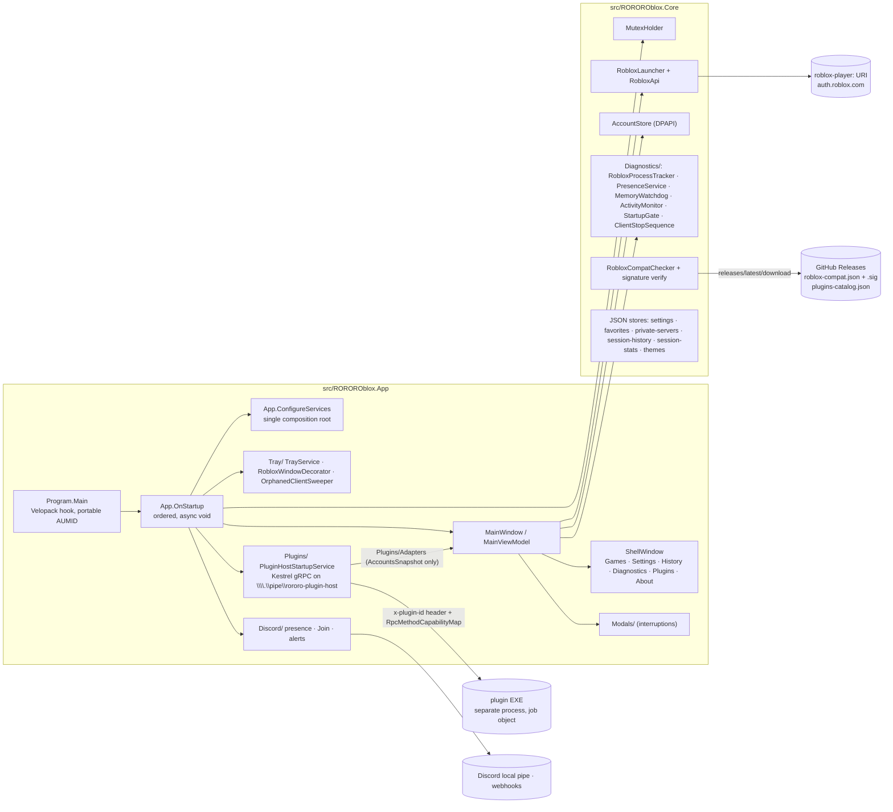

# RoRoRo architecture

One page: where things live, what talks to what, and how the two core ideas flow at runtime. Line numbers are left out on purpose; grep the named symbol. Per-feature status is in [features.md](features.md); why things are the way they are is in [decisions.md](decisions.md); the operating rules are in [CLAUDE.md](../CLAUDE.md).

## Projects (`ROROROblox.slnx`)

| Project | Role | Worth knowing |
|---|---|---|
| `src/ROROROblox.App` | The WPF process: composition root, `MainWindow` + `MainViewModel`, tray, modals, Shell pages, plugin host, Discord. | Entry is a hand-written `Program.Main` (`<StartupObject>`), not the XAML-generated one. `MainViewModel` is ~4,300 lines and owns all mutable UI state. |
| `src/ROROROblox.Core` | Everything testable without WPF: interfaces, records, Win32 primitives, JSON/DPAPI stores, `Diagnostics/`. | Targets `net10.0-windows` too (CsWin32 `CreateMutex`, DPAPI). No UI types. Specs that said "App/…" for pure logic were built here on purpose so they stay testable without WPF (the unit suite references App too, but Core has no UI dependencies). |
| `src/ROROROblox.PluginContract` | The gRPC `.proto` and generated C#, shipped to nuget.org as `ROROROblox.PluginContract`. | `netstandard2.1`; versioned independently (0.9.0 at HEAD). The wire `contract_version` stays `"1.0"`; additive RPCs only. |
| `src/ROROROblox.Tests` | xUnit unit suite plus three instrument families (see below). | 1,899 tests at HEAD. Reads the repo checkout from disk; finds it by walking up to `ROROROblox.slnx`. |
| `src/ROROROblox.PluginTestHarness` | Real Kestrel + named-pipe gRPC integration tests. | 25 tests, one permanently `[Skip]`ped. References the App project directly. |
| `tools/CompatSigner` | Signs `roblox-compat.json` in CI. | References Core so signer and verifier share one signature format. |

## Runtime map

## Startup order (`App.OnStartup`)

The order is load-bearing. `OnStartup` is `async void` by design so continuations stay on the UI thread for dispatcher-affine work.

1. `Program.Main`: `VelopackApp.Build().SetArgs(args).Run()` first, then the portable-install AppUserModelID override, then WPF.
2. Render-harness suppression check (`App.SuppressStartupForRenderHarness`; only the test harness sets it).
3. Serilog to `%LOCALAPPDATA%\ROROROblox\logs\rororoblox-<date>.log`; global exception nets; the dark-title-bar class handler (`Theming/WindowTheming`).
4. `AppLifecycle/SingleInstanceGuard`: mutex `Local\ROROROblox-app-singleton` plus a named pipe. A second instance writes `SHOW` or `JOIN:<uri>` down the pipe and exits.
5. `Discord:ApplicationId` read from `appsettings.json` beside the exe with a raw `JsonDocument` parse (there is no `IConfiguration` anywhere). When the id is non-empty, unpackaged builds register the `roblox-rororo:` scheme in HKCU; packaged builds skip the write — the manifest's `uap10:Protocol` entries own both schemes there (v1.24). The committed file ships the real id.
6. `ConfigureServices` builds the provider. Everything is a lazy singleton; WPF-affine singletons (`ITrayService`) go through `UiBoundFactory` so they construct on the dispatcher whoever resolves them first.
7. Theme applied synchronously (`ThemeService.ApplyAtStartup`, a deliberate `GetResult()`; the async form deadlocked).
8. The singleton **name** is resolved (`RobloxCompatChecker.ResolveMutexNameAsync`: signed remote config → `last-known-mutex.txt` → hardcoded default) and written into `Startup/ResolvedMutexName` **before** anything resolves `IMutexHolder`. Resolving it earlier freezes the hardcoded name for the session.
9. `IMutexHolder.TryAcquire` → `StartupGate.Evaluate` → Clean, SharedLock, Blocked, or Leftover.
10. The plugin-host pipe binds here, before any gate modal can block, so an agent can reach the host while a dialog waits.
11. Gate branch: Blocked → `SeamlessTakeover` of windowless tray clients, else `RobloxAlreadyRunningWindow` (with Start anyway); Leftover → windowless strays cleared silently (`LeftoverStartupDecision`), a windowed one asks (`LeftoverProcessesWindow`); SharedLock → proceed without the handle, the contested watcher banners it.
12. The `Wire*` / `Initialize*` run: tray table (`Tray/TrayWiring`), window decorator + orphan sweeper, plugin event bus, activity monitor, memory watchdog, contested watcher, plugin autostart (only now, after the gate), idle settings, streamer mode, Discord presence, alerts. The passenger steps (decorator, event bus, activity monitor, watchdog, idle, streamer, Discord, alerts) are each try/catch-and-continue so a passenger feature never blocks a launch; the tray table, VM events, and mutex-lost hooks are not wrapped.
13. `tray.Show()`, pipe listener start, `mainWindow.Show()`.
14. Fire-and-forget: session-stats backfill, cold-start Discord join, the theme edge-remediation question, then `RunStartupChecksAsync` (WebView2 profile sweep, Velopack update probe, compat-drift banner, re-attach scan of running Roblox windows by title, 5 s-delayed RobloxUserId backfill, guarded launch-main-on-startup).

`OnExit` reverses it: plugin processes → plugin host (2 s bound on the thread pool) → pollers and sweepers → Discord presence → single-instance guard → container `DisposeAsync` (2 s bound) → log flush.

## The two core ideas

**Multi-instance is a name race, not a lock.** Roblox creates a kernel *Event* named `Local\ROBLOX_singletonEvent`. RoRoRo creates a *Mutex* under that name first (`Core/MutexHolder.cs`, raw `CreateMutex` via CsWin32), so Roblox's create fails and it never installs single-instance enforcement. `ERROR_INVALID_HANDLE` on our create means Roblox already owns the name (multi-instance genuinely off → Blocked). `ERROR_ALREADY_EXISTS` means another RoRoRo or compatible tool owns it as a Mutex and multi-instance already works (→ SharedLock, never a modal). The name comes from `roblox-compat.json`; `Diagnostics/MutexContestedWatcher` banners runtime contention; a 5 s watchdog inside `MutexHolder` detects a lost handle.

**Launch-as-account.** `MainViewModel.LaunchAccountAsync` → `Core/RobloxLauncher.LaunchAsync`: cookie from `AccountStore` → identity stamped into Roblox's `appStorage.json` (`App/Diagnostics/AppStorageDefender`) → `LaunchTarget` chosen in the VM (a pasted share link was resolved via `apis.roblox.com/sharelinks` when it was parsed) → FPS cap written to `ClientAppSettings.json` and `GlobalBasicSettings_<N>.xml` and settled by `FpsCapSettler` → `DefaultGame` resolved to the default favourite → two POSTs to `auth.roblox.com/v1/authentication-ticket` (CSRF dance in `RobloxApi`, HttpClient registered with `UseCookies=false`, User-Agent `RORORO/<version>`) → `roblox-player:1+launchmode:play+gameinfo:<ticket>+launchtime:…+placelauncherurl:<PlaceLauncher.ashx…>+browsertrackerid:…` handed to ShellExecute (`launchmode:app` with no `placelauncherurl` for Home) → `Diagnostics/RobloxProcessTracker` claims the new `RobloxPlayerBeta` pid by start time → `Tray/RobloxWindowDecorator` titles the window `Roblox - {name}`, which is the only re-attach key the scanner and orphan sweeper have.

Row state is "presence-as-truth": `PresenceService` polls each account's own presence every 25 s; a row is Closed only when presence and process tracking agree.

## Data on disk (`%LOCALAPPDATA%\ROROROblox\`)

One folder for every install type — verified live 2026-08-30: the Store build writes here too (Windows does not virtualize the app's file writes), so an uninstall leaves the folder, and vault, behind.

| File | Owner | Protection |
|---|---|---|
| `accounts.dat` | `Core/AccountStore` | DPAPI CurrentUser, whole blob; holds the cookies |
| `consent.dat` | `App/Plugins/ConsentStore` | DPAPI |
| `discord.dat` | `Core/Discord/DiscordConfigStore` | DPAPI (webhook URLs are bearer credentials) |
| `streamer-identities.dat` | `Core/StreamerMode/FileStreamerIdentityStore` | **plaintext** despite the suffix; never a secret store |
| `settings.json`, `favorites.json`, `private-servers.json`, `session-history.json`, `session-stats.json` | one sealed store class each in Core | plaintext JSON, `Version: 1` stamped (nothing branches on it yet; `PrivateServerStore` migrates legacy rows by field shape) |
| `themes\*.json` | `Core/Theming/ThemeStore` | plaintext, snake_case keys |
| `plugins\<id>\` | `App/Plugins/PluginRegistry` | plain files |
| `logs\`, `webview2-data\<guid>\`, `last-update-check.txt`, `last-known-mutex.txt`, `.welcome-shown` | `AppLogging`, `Core/WebView2UserDataDirectory` (used by `CookieCapture`), `UpdateChecker`, `RobloxCompatChecker`, `WelcomeWindow` | plaintext |

The JSON stores and `accounts.dat` are `SemaphoreSlim`-gated load-modify-save with a tmp-file + `File.Move` atomic write. `themes\*.json` is tmp+Move without a gate; `streamer-identities.dat` is gated but writes in place; `discord.dat` and `consent.dat` write directly.

Roblox-side files the app writes: `%LOCALAPPDATA%\Roblox\GlobalBasicSettings_<N>.xml` (`FramerateCap`, the lever that actually wins), `ClientAppSettings.json` under the newest active version folder of each install kind, standalone and UWP (`DFIntTaskSchedulerTargetFps`), and `LocalStorage\appStorage.json` (identity stamp).

## Plugin boundary

Plugins are separate EXEs because Store policy 10.2.2 forbids downloadable code in the Store binary. They dial one shared named pipe, identify themselves with an `x-plugin-id` request header, and every RPC is checked by `Plugins/CapabilityInterceptor` against `RpcMethodCapabilityMap` (exhaustive and fail-closed; an RPC without a map entry stops the host from binding) and the plugin's DPAPI consent record. Host events flow `App → InProcessPluginEventBus → bounded channel → server-streaming RPC`. `Plugins/Adapters/` bridge the service to `MainViewModel` (always through `AccountsSnapshot`, never the `ObservableCollection`), `IMutexHolder`, the process tracker, and `ThemeService`; `Plugins/ActivitySnapshotProvider` bridges `ActivityMonitor`. An RPC missing from the map makes the bind task fault; that is logged at Debug and plugins are silently off for the session (the code comments that say it "crashes" are stale). Plugin processes live in an unnamed kill-on-close job object (`PluginJobObject`, the only unsafe code in the app). The in-app marketplace reads `plugins-catalog.json` from the latest GitHub release and is enabled only when `Distribution/Win32DistributionMode.IsPackaged` is false. The MCP connector (`rororo-ur-mcp`) is a plugin in a sibling repo; this repo only added the `GetAccounts` RPC for it.

## Test instruments

- **Fences** scan `src/ROROROblox.App/**` XAML and C# as text: `ButtonRankFenceTests` (a button may not paint itself), `ThemedStatusColourTests`, `AccessibleNamingFenceTests`, `TypeLadderFenceTests`, `WindowChromeFenceTests`, `WindowSizingFenceTests`, `KeyboardVocabularyTests`, `BrandNameFenceTests`, `InteractiveEdgeBindingTests`, `XamlStyleIntegrityTests`. They carry vacuity floors and ratchet ceilings.
- **Gates** measure: `ContrastPairGateTests` (token arithmetic through the real `ThemeService.ApplyTo`, and it parses the findings register markdown for its exemptions) and `Rendering/*` (real WPF rendered offscreen; `Sta.cs` gives a fresh STA thread per control render, `WindowRenderHost` owns the assembly's one real `App` for whole windows).
- **Wiring** tests call the real `App.ConfigureServices`: `ThemeFeedWiringTests`, `SavedAccountsWiringTests`, `SessionStatsWiringTests`, and one in `RobloxLauncherTests`. `TypedHttpClientRegistrationTests` mirrors the `AddHttpClient<I,T>` registrations by hand to guard the single-ctor rule.
- No mocking library. Doubles are private nested fakes that throw on unused members.

## Build and ship

`ROROROblox.slnx` → `.github/workflows/ci.yml` (a `guards` job runs the secret scan and local-path guard over the full tree, then the full solution builds and tests on `windows-latest` and natively on `windows-11-arm`) → tag `vX.Y.Z.0` → `release.yml` (tests, `vpk pack`, a **draft** GitHub Release via `vpk upload github --merge`, then `tools/CompatSigner` signs `roblox-compat.json` and `gh release upload` attaches the json, `.sig`, and `docs/store/plugins-catalog.json`). The Store MSIX is built locally: `scripts/finalize-store-build.ps1` patches the csproj `<Version>` and `Package.appxmanifest` together and calls `scripts/build-msix.ps1 -Store`, once for x64 and once for arm64. The sideload MSIX signs the same package with the gitignored `dev-cert.pfx`. `compat.yml` (manual) re-signs and re-attaches `roblox-compat.json` to the current latest release without a tag. Runbook: `docs/store/release-playbook.md`.
